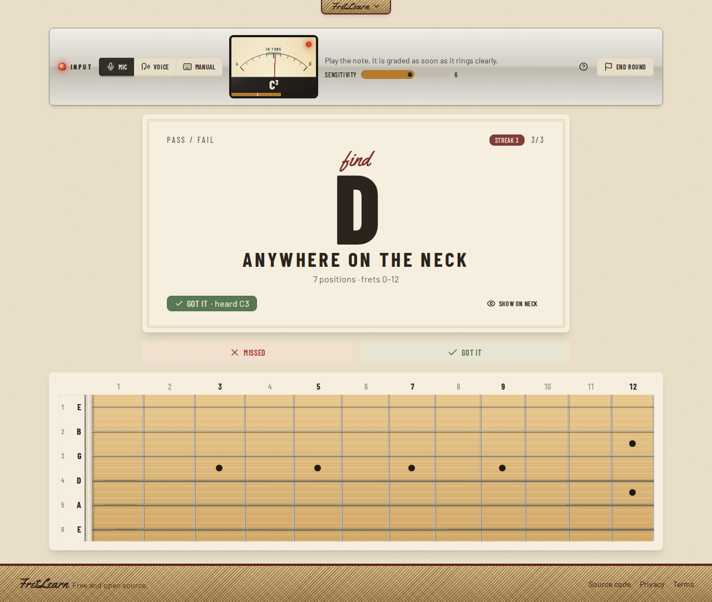
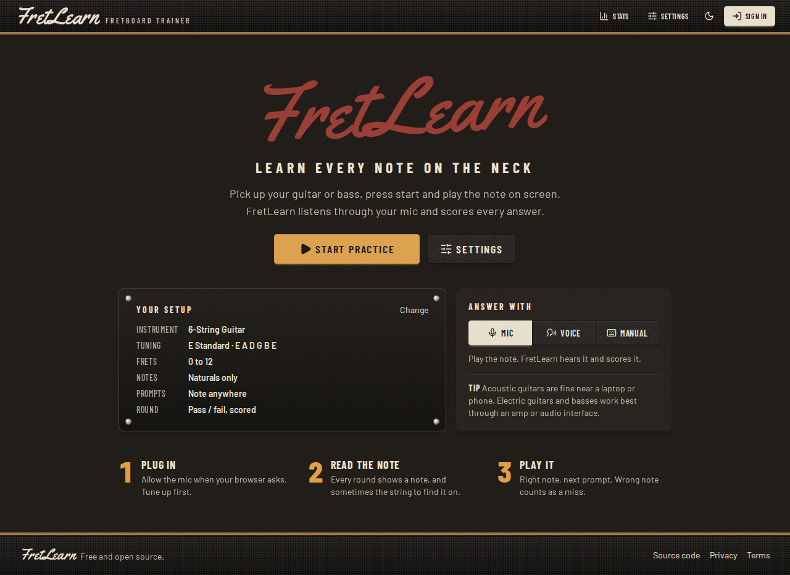

# FretLearn

Learn every note on the guitar or bass neck. FretLearn shows you a note, you play it, and it listens through your
microphone to tell you whether you got it right.

Free, open source, and runs entirely in the browser. Live at [fretlearn.app](https://fretlearn.app).



## What it does

- **Hears what you play.** Pick up your instrument, press start and play the note on screen. The right note scores a
  point; any other note is a miss and you move on. No tapping, no honour system.
- **Two kinds of prompt.** "Find C" anywhere in your fret range, or "find C on the A string". String prompts only accept
  the exact pitch that string makes inside the range, so the same note on the wrong string usually won't count.
- **Any instrument you tune.** 6- and 7-string guitar, 4- and 5-string bass, drop, open and modal tunings, or build your
  own with 4–8 strings and 12–24 frets.
- **Shows you the answer.** A fretboard with real string gauges and inlays lights up every position of the note.
- **Tracks progress, no account needed.** Accuracy over time, a note-by-note grid of what you know, accuracy per
  string and your weak spots. Stats are kept on your device, or in your account when you sign in.
- **Drills your weak spots.** One tap starts a round on the notes you miss most (or the ones you just missed), and
  normal rounds bring missed notes back more often. You can turn that off in Settings.
- **Other ways to answer.** Say "got it" or "missed", tap the buttons, or use Space and M (Bluetooth page-turner
  pedals work too).
- **Day and night themes.** Tweed (aged cream lacquer) and Tolex (black amp covering).



## How note detection works

All audio processing happens in your browser. Nothing is recorded or uploaded.

1. The mic is opened with the browser's voice-call processing (echo cancellation, noise suppression, auto gain)
   switched off, since those smear pitch and pump the level of a plucked string.
2. About 30 times a second, the last ~85 ms of audio is downsampled to ~22 kHz and run through the
   [YIN](http://audition.ens.fr/adc/pdf/2002_JASA_YIN.pdf) pitch detector, limited to the range your instrument can
   play (a 5-string bass's low B up to a guitar's 24th fret).
3. A note tracker turns those readings into "note played" events: a pitch has to hold steady for about 100 ms,
   a ringing string isn't counted twice, re-plucking the same note counts again, and a pitch change with no fresh
   attack has to hold much longer.
4. The event is graded against the prompt. Octaves come from the tuning: each string's octave is inferred from
   where that string sits in standard tuning (Drop D's low string is D2, a 5-string bass's low B is B0).

Code: [`src/lib/pitchDetection.js`](src/lib/pitchDetection.js) and `gradeDetectedNote` in
[`src/lib/fretLogic.js`](src/lib/fretLogic.js). Both are covered by tests that synthesise plucked strings for every
note on a guitar and a 5-string bass.

**Limits worth knowing**

- A mic can't tell strings apart when the pitch is identical (the open A and the D string at fret 7 sound the same).
- Tune up first. A string more than a quarter-tone off can be read as the neighbouring note.
- Acoustic guitars are fine with a laptop or phone mic. Electric guitars and basses work best through an amp or an
  audio interface.

## Running it locally

You need Node.js 22.12 or newer.

```bash
git clone https://github.com/capsloco/fretboard_app.git
cd fretboard_app
npm install
npm run dev
```

Open http://localhost:5173. Browsers only allow the microphone on secure pages: `localhost` works, but testing from a
phone or another device on your network needs HTTPS.

| Command | What it does |
| --- | --- |
| `npm run dev` | Dev server with hot reload |
| `npm test` | Unit tests (Vitest) |
| `npm run lint` | Lint (oxlint) |
| `npm run build` | Production build into `dist/` |
| `npm run preview` | Serve the production build |

### Configuration

Everything works without configuration: settings, custom instruments and practice stats are kept in `localStorage`. Copy
`.env.example` to `.env.local` to turn on the optional services.

| Variable | Purpose |
| --- | --- |
| `VITE_SUPABASE_URL`, `VITE_SUPABASE_PUBLISHABLE_KEY` | Accounts (Google, email link, password), cloud sync and practice history via [Supabase](https://supabase.com). Run the files in [`supabase/migrations/`](supabase/migrations/) in order in the Supabase SQL editor once. |
| `VITE_GTM_ID` | Google Tag Manager container ID. Unset means no analytics and no cookie banner. |

## Tech

React 19, Vite 8, Tailwind CSS 4 and daisyUI 5 (two custom themes in [`src/index.css`](src/index.css)), the Web Audio
API for detection, the Web Speech API for voice commands, Supabase for accounts, Recharts for stats, and Vitest.

```
src/
  App.jsx                  session state and flow
  components/
    home/                  start screen
    session/               input panel, needle meter, prompt card, round summary
    fretboard/             fretboard renderer
    settings/, ui/         settings, modals, header
    history/               stats screen
  hooks/usePitchListener.js
  lib/
    pitchDetection.js      YIN, note tracker, microphone listener
    fretLogic.js           notes, tunings, prompts, grading
    statsLogic.js          note, string and round stats; weak spots; adaptive weights
    practiceHistory.js     saved rounds (account or this device)
    voice.js               voice commands
    supabase.js            accounts and storage (with localStorage fallback)
    analytics.js           optional Google Tag Manager
```

## Contributing

Bug reports, tunings and pull requests are welcome. See [CONTRIBUTING.md](CONTRIBUTING.md).

## License

[MIT](LICENSE)
